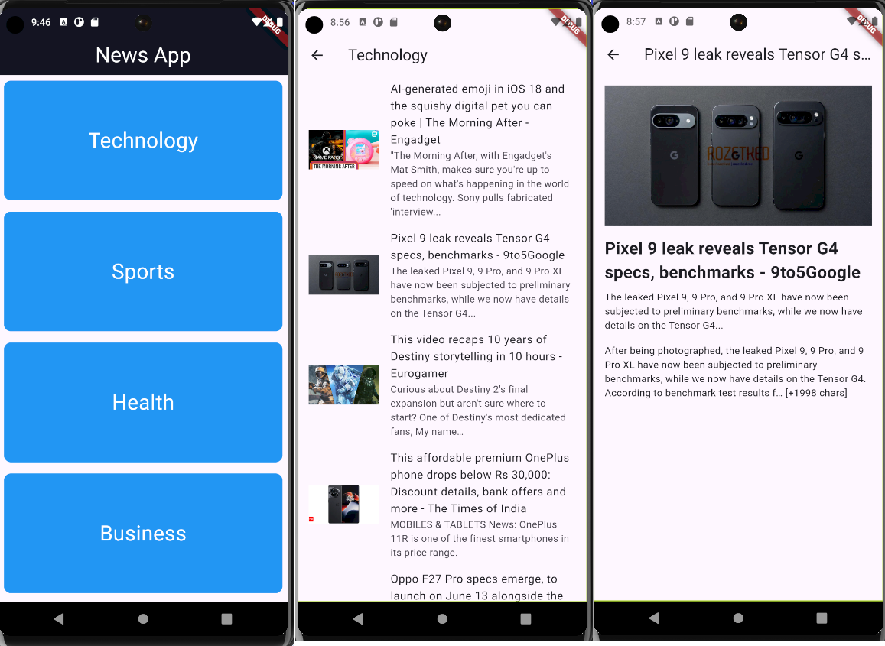

# Mobile Application Development Course Project



## #EN

Erciyes University Computer Engineering  
Mobile Application Development  
Asst. Prof. Fehim KÖYLÜ  

This project is a mobile application that fetch news from an API and presents it to the user in the interface using Flutter.

### Features

- Pull news from API  
- Listing news  
- View news details  
- Modern and user-friendly interface

### Requirements

- Flutter 
- Dart 

### How to Run

```
git clone https://github.com/serdarcubuk/News-Flutter-Mobile-App.git  

cd News-Flutter-Mobile-App

flutter pub get  

flutter run
```

## #TR

Erciyes üniversitesi Bilgisayar Mühendisliği  
Mobil Uygulama Geliştirme    
Dr. Öğr. Üyesi Fehim KÖYLÜ


Bu proje, haberleri bir API'den çekip, Flutter kullanarak kullanıcıya arayüzde sunan bir mobil uygulamadır.

### Özellikler

- API'den haberleri çekme  
- Haberleri listeleme  
- Haber detaylarını görüntüleme  
- Modern ve kullanıcı dostu arayüz  

### Gereksinimler
- Flutter 
- Dart 

### Kurulum

```
git clone https://github.com/serdarcubuk/News-Flutter-Mobile-App.git  

cd News-Flutter-Mobile-App

flutter pub get  

flutter run
```
---
Ahmet Serdar ÇUBUK  
1030521039